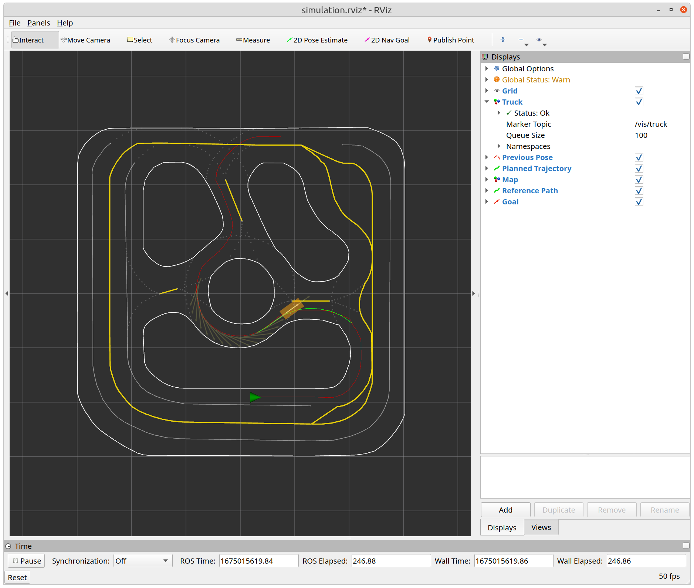
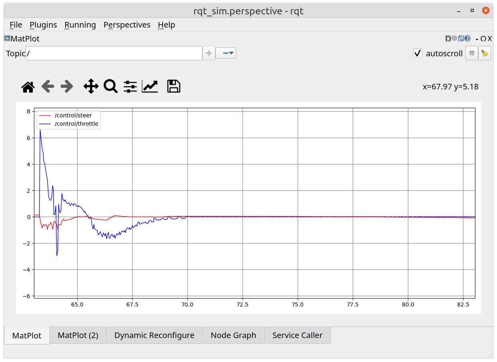

# PrincetonRaceCar Interface
Rviz and RQT interface to visualize the status and plan of the race car.

This module allows you to monitor the state of robot and visualize the path planning. In addition, use verstaile RQT interface to send ROS service calls to the robot and update dynamic parameters.

